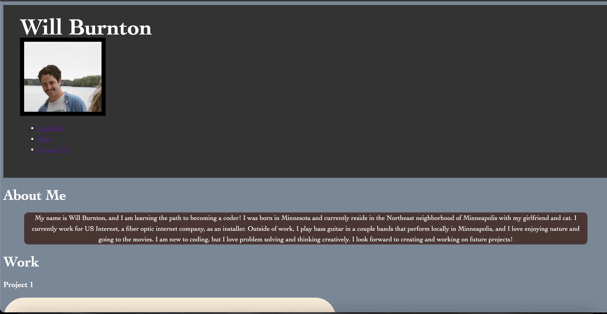

# Portfolio-Assignment# <Your-Project-Title>

## Description

Provide a short description explaining the what, why, and how of your project. Use the following questions as a guide:

I have created a portfolio to display information about me, my work, and ways to contact for future employers. 

-As I build projects within the bootcamp, I hope to add work to my portfolio to show employers what I've created. 

-I can hopefully come back and update the code with new things I've learned from bootcamp 

-I learned that CSS can be a little difficult! Doing assignments in class is one thing, but building a webpage from scratch is a whole other process. I realized I still have much to learn, but building this webpage helped me learn a lot.  


- What was your motivation?
- Why did you build this project? (Note: the answer is not "Because it was a homework assignment.")
- What problem does it solve?
- What did you learn?


## Installation

Go to // enter link here // 

## Usage

Provide instructions and examples for use. Include screenshots as needed.

To add a screenshot, create an `assets/images` folder in your repository and upload your screenshot to it. Then, using the relative filepath, add it to your README using the following syntax:

    ```md
    
    ```


## License

Project used the MIT License 

🏆 The previous sections are the bare minimum, and your project will ultimately determine the content of this document. You might also want to consider adding the following sections.


